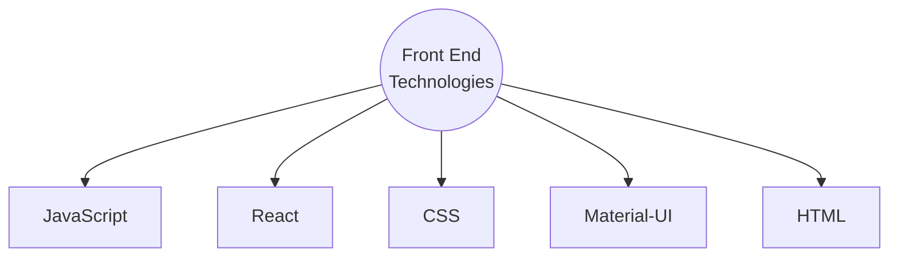
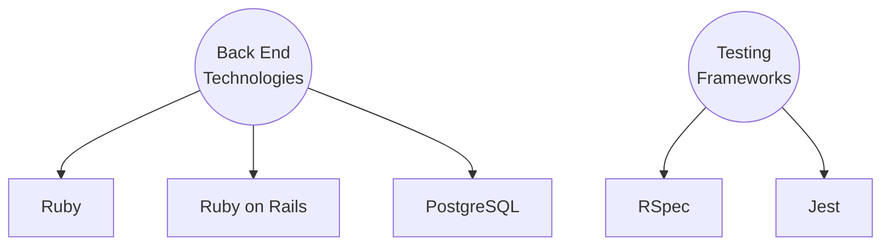

# 
 
 
 Full-Stack Web Application 

## 
 Developers 
 
 Techical  Lead: <a href="https://www.linkedin.com/in/davidthomas91/">David Thomas</a> 
Project & Product Manager: <a href="https://www.linkedin.com/in/jeremy-duncan2021/">Jeremy Duncan</a> 
Lead Designer: <a href="https://www.linkedin.com/in/michyherrera/">Michy Herrera</a>

 

---
## 
Description
### This is a Mobile-Friendly Full-Stack Web Application developed with a React-Rails configuration utilizing Test Driven Development and Team Programming.
## Application Features:
* User can create an account.
* User can login with their account credentials.
* A user can add a restaurant to the database.
* A user can see any restaurants other users have added to the application.
* A user can edit the details of a restaurant.
* A user can add a review rating to a restaurant.
* A user can see reviews and ratings of restaurants from other users.
* A User can see a collection of the restaurants they have reviewed.
* A user can remove a restaurant.
* User can let the web application choose a restaurant for them to dine at.

 

---

 

## Tech Stack Used: 

 

-----

## 
 Reference links:

### Front-End:
* <a href="https://developer.mozilla.org/en-US/docs/Web/JavaScript">JavaScript</a>
* <a href="https://reactjs.org/docs/getting-started.html">React</a>
* <a href="https://developer.mozilla.org/en-US/docs/Web/CSS">CSS</a>
* <a href="https://mui.com/material-ui/getting-started/overview/">Material UI</a>

### Back-End:
* <a href="https://www.ruby-lang.org/en/">Ruby</a>
* <a href="https://rubyonrails.org/">Ruby on Rails</a>
* <a href="https://www.postgresql.org/">PostgreSQL</a>

### Testing:
* <a href="https://rspec.info/">RSpec</a>
* <a href="https://jestjs.io/">Jest</a>

